<h1 align="center">
    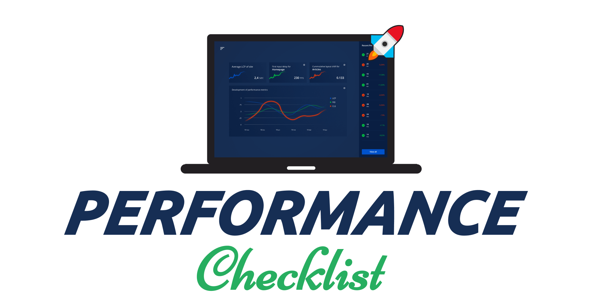
</h1>

<h4 align="center">📈 The Performance Checklist is a comprehensive list of performance optimization techniques to improve your site's performance, and with it, its user experience. 🆙
<br />
<i>“Premature optimization is the root of all evil” - Donald Knuth</i>
</h4>

<p align="center">
    <a href="https://webtips.dev"></a>
    <a href="https://twitter.com/flowforfrank"></a>
    <a href="https://medium.com/@ferencalmasi"></a>
    <br />
    <a href="https://www.buymeacoffee.com/webtips" target="_blank"></a>
    <br />• • •<br />
    <a href="https://github.com/flowforfrank/seo-checklist" alt="Check out the SEO checklist">🕵️ SEO Checklist</a>
</p>

## 🗃️ Table of Contents

1. **🛠️ [Tools](#%EF%B8%8F-tools)**  
    1.1. [Built-in Tools](#built-in-tools)
    - 1.1.1. [Lighthouse](#%EF%B8%8F-lighthouse)
    - 1.1.2. [Network Tab](#%EF%B8%8F-network-tab)
    - 1.1.3. [Performance Tab](#%EF%B8%8F-performance-tab)
    - 1.1.4. [Memory Tab](#%EF%B8%8F-memory-tab)
    - 1.1.5. [Layers Panel](#%EF%B8%8F-layers-panel)
    - 1.1.6. [Coverage Drawer](#%EF%B8%8F-coverage-drawer)
    - 1.1.7. [Issues Drawer](#%EF%B8%8F-issues-drawer)
    - 1.1.8. [Rendering Drawer](#%EF%B8%8F-rendering-drawer)
    - 1.1.9. [Request Blocking Drawer](#%EF%B8%8F-request-blocking-drawer)

    1.2. [Online Tools](#online-tools)
    - 1.2.1. [Webhint](#-webhint)  
    - 1.2.2. [PageSpeed Insights](#-pagespeed-insights)  
    - 1.2.3. [Web.dev](#-webdev)
    - 1.2.4. [Bundlephobia](#-bundlephobia)
    - 1.2.5. [GTMetrix](#-gtmetrix)
    - 1.2.6. [WebPageTest](#-webpagetest)
    - 1.2.7. [Pingdom Website Speed Test](#-pingdom-website-speed-test)
    - 1.2.8. [Varvy](#-varvy)

    1.3. [Chrome Extensions](#chrome-extensions)
    - 1.3.1. [React Developer Tools](#-react-developer-tools)
    - 1.3.2. [Web Vitals](#-web-vitals)
2. **🏗️ [HTML Optimization](#%EF%B8%8F-html-optimization)**  
    2.1. [Write Valid and Readable DOM](#%EF%B8%8F-write-valid-and-readable-dom)  
    2.2. [Don't Use Inline Styles and Scripts](#%EF%B8%8F-dont-use-inline-styles-and-scripts)  
    2.3. [Inline Critical CSS](#%EF%B8%8F-inline-critical-css)  
    2.4. [Place Script Tags at the Bottom](#%EF%B8%8F-place-script-tags-at-the-bottom)  
    2.5. [Avoid Using Plugins](#%EF%B8%8F-avoid-using-plugins)  
    2.6. [Reduce the Number of DOM Elements](#%EF%B8%8F-reduce-the-number-of-dom-elements)  
    2.7. [Compress HTML](#%EF%B8%8F-compress-html)
3. **🖍️ [CSS Optimization](#%EF%B8%8F-css-optimization)**  
    3.1. [Reconsider if you really need a framework](#%EF%B8%8F-reconsider-if-you-really-need-a-framework)  
    3.2. [Prefer Using a CSS Methodology](#%EF%B8%8F-prefer-using-a-css-methodology)  
    3.3. [Use Markup Instead of CSS](#%EF%B8%8F-use-markup-instead-of-css)  
    3.4. [Use Shorthand Properties](#%EF%B8%8F-use-shorthand-properties)  
    3.5. [Reduce Redundancy](#%EF%B8%8F-reduce-redundancy)  
    3.6. [Avoid Complex Selectors](#%EF%B8%8F-avoid-complex-selectors)  
    3.7. [Use Mobile First](#%EF%B8%8F-use-mobile-first)  
    3.8. [Compress CSS](#%EF%B8%8F-compress-css)  
4. **👨‍💻 [JavaScript Optimization](#-javascript-optimization)**  
    4.1. [Defer JavaScript Files](#%EF%B8%8F-defer-javascript-files)  
    4.2. [Update Libraries](#%EF%B8%8F-update-libraries)  
    4.3. [Use Web Workers](#%EF%B8%8F-use-web-workers)  
    4.4. [Eliminate Long-running Tasks](#%EF%B8%8F-eliminate-long-running-tasks)  
    4.5. [Use the Coverage Drawer](#%EF%B8%8F-use-the-coverage-drawer)  
    4.6. [Avoid Micro-Optimization](#%EF%B8%8F-avoid-micro-optimization)  
    4.7. [Compress JavaScript](#%EF%B8%8F-compress-javascript)
5. **🖼️ [Image Optimization](#%EF%B8%8F-image-optimization)**  
    5.1. [Replace Images](#%EF%B8%8F-replace-images)  
    5.2. [Use Vector Images](#%EF%B8%8F-use-vector-images)  
    5.3. [Minify SVG Markup](#%EF%B8%8F-minify-svg-markup)  
    5.4. [Choose the Right Raster Format](#%EF%B8%8F-choose-the-right-raster-format)  
    5.5. [Scale Your Images](#%EF%B8%8F-scale-your-images)  
    5.6. [Lazy Load Images](#%EF%B8%8F-lazy-load-images)  
    5.7. [Compress Images](#%EF%B8%8F-compress-images)
6. **🗛 [Font Optimization](#-font-optimization)**  
    6.1. [Minimize Number of Font Use](#%EF%B8%8F-minimize-number-of-font-use)  
    6.2. [Subset Fonts](#%EF%B8%8F-subset-fonts)  
    6.3. [Implement Custom Font-loading Strategies](#%EF%B8%8F-implement-custom-font-loading-strategies)  
    6.4. [Cache Fonts](#%EF%B8%8F-cache-fonts)  
    6.5. [Compress Fonts](#%EF%B8%8F-compress-fonts)
7. **🗄️ [Server Optimization](#%EF%B8%8F-server-optimization)**  
    7.1. [Configure Compression](#%EF%B8%8F-configure-compression)  
    7.2. [Minimize the Number of HTTP Requests](#%EF%B8%8F-minimize-the-number-of-http-requests)  
    7.3. [Use a CDN](#%EF%B8%8F-use-a-cdn)  
    7.4. [Use a Cache-Control Header](#%EF%B8%8F-use-a-cache-control-header)  
8. **🇼 [Core Web Vitals](#-core-web-vitals)**  
    8.1. [Largest Contentful Paint](#%EF%B8%8F-largest-contentful-paint)  
    8.2. [First Input Delay](#%EF%B8%8F-first-input-delay)  
    8.3. [Cumulative Layout Shift](#%EF%B8%8F-cumulative-layout-shift)  
    8.4. [How to Measure Core Web Vitals](#%EF%B8%8F-how-to-measure-core-web-vitals)
9. **⚛️ [Frameworks](#%EF%B8%8F-frameworks)**  
    9.1. [React Optimization Techniques](#react-optimization-techniques)
    - 9.1.1. [Use Production Build](#%EF%B8%8F-use-production-build)
    - 9.1.2. [Profile Components](#%EF%B8%8F-profile-components)
    - 9.1.3. [Virtualize Long Lists](#%EF%B8%8F-virtualize-long-lists)
    - 9.1.4. [Pre-render Routes](#%EF%B8%8F-pre-render-routes)
10. **📚 [Other Resources](#-other-resources)**

## 🛠️ Tools
ℹ️ *If you can't measure it, you can't improve it - Before you make any changes, the first step is to measure performance. This way, you will have a baseline and you can make comparisons later on. Never make performance optimizations, without first creating a baseline.*

> 🆓 The tools listed below are free to use

### Built-in Tools
ℹ️ *Built-in tools will be your first station in improving performance. If you don't find a certain tab in DevTools, you can open the tools pane by hitting `ctrl` + `shift` + `p`.*

> #### 🛠️ [Lighthouse](https://developers.google.com/web/tools/lighthouse)
> Lighthouse will be one of your best friends for performance audits. It is built into Chrome's DevTools, and can create audits for performance, accessibility, progressive web apps, SEO and more. If you don't happen to find the audit you are looking for your specific use case, it also lets you create your own plugins.
>
> The generated audit also contain further resources for explanation of failed audits, and steps on how to resolve them.
>
> 📖 [GitHub - Plugin Handbook](https://github.com/GoogleChrome/lighthouse/blob/master/docs/plugins.md)
----------

> #### 🛠️ Network Tab
> Use the *Network* tab to identify issues related to network requests. These can be things like:
>
> - Long server response times
> - Verify resources are compressed
> - Identifying large resource sizes
> - Making sure resources are downloaded or uploaded correctly
>
> You can also use the Network tab to simulate slow network connection, or even simulate offline state.
>
> 📖 [Chrome DevTools - Inspect Network Activity In Chrome DevTools](https://developers.google.com/web/tools/chrome-devtools/network)


----------

> #### 🛠️ Performance Tab
> The performance tab is where you can identify most of the issues related to performance, such as:
>
> - FPS drops
> - High CPU usage
> - Memory leaks
> - Long running JavaScript tasks
> - Forced reflows
>
> The performance tab also shows you the time frame of different key events and core web vitals, such as **First Paint**, **First Contentful Paint**, **Largest Contentful Paint**, **DOMContentLoaded** event, or the **Onload** event.
>
> 📖 [Chrome DevTools - Get Started With Analyzing Runtime Performance](https://developers.google.com/web/tools/chrome-devtools/evaluate-performance)  
> 📖 [Chrome DevTools - Performance Analysis Reference](https://developers.google.com/web/tools/chrome-devtools/evaluate-performance/reference)
----------

> #### 🛠️ Memory Tab
> If you suspect your application has memory leaks, this is where you can:
>
> - Create heap snapshots
> - Record memory usage over time
>
> To identify the root cause of the problem. If you experience one of the followings, it is likely you have memory leaks.
>
> - Slow load times
> - Sluggish performance
> - The performance of the application degrades over time
> - High memory usage
>
> 📖 [Chrome DevTools - How to Record Heap Snapshots](https://developers.google.com/web/tools/chrome-devtools/memory-problems/heap-snapshots)  
> 📖 [Chrome DevTools - Fix Memory Problems](https://developers.google.com/web/tools/chrome-devtools/memory-problems)
----------

> #### 🛠️ Layers Panel
> The *Layers* panel can help you visualize different layers on your website and identify, if:
>
> - You have too many layers
> - You can prevent repaint of large areas by promoting them to new composite layers
>
> You also get to know the reason for having elements on different layers.
>
> 📖 [LogRocket - Eliminate content repaints with the new Layers panel in Chrome](https://blog.logrocket.com/eliminate-content-repaints-with-the-new-layers-panel-in-chrome-e2c306d4d752/)

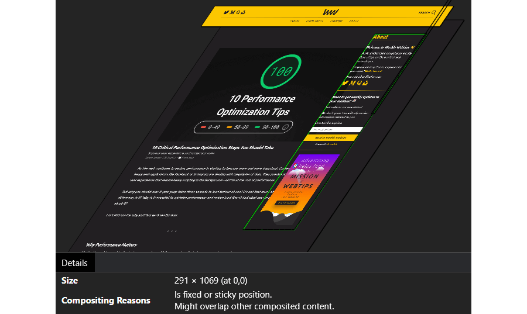

----------

> #### 🛠️ Coverage Drawer
> The *Coverage* drawer in Chrome DevTools can help you find unused JavaScript and CSS. Removing them can speed up your page load and reduce the number of bytes transferred.
>
> ❗ When you are doing analysis, make sure you interact with the page before deeming a piece of code "unused".
>
> Anything that is shown in red inside the Coverage drawer can be potentially deferred to speed up initial page load.
>
> 📖 [Find Unused JavaScript And CSS Code With The Coverage Tab In Chrome DevTools](https://developers.google.com/web/tools/chrome-devtools/coverage)
----------

> #### 🛠️ Issues Drawer
> The *Issues* drawer aims to combine common issues in your Console tab, to de-clutter it. It aggregates similar issues and provides resources with actions on how to resolve them.
----------

> #### 🛠️ Rendering Drawer
> The *Rendering* drawer lets you identify issues related to rendering. With the rendering drawer, you have the ability to:
>
> - Highlight areas of the page that needs to be repainted
> - Highlight areas of the page that were shifted
> - Highlight ad frames
> - Show layer borders
> - Show FPS
> - Show scrolling performance issues
> - Show borders around hit-test regions
>
> You also have the ability to emulate different types of media type — such as `print` or `screen` — and different vision deficiencies:
>
> - Blurred vision
> - Protanopia
> - Deuteranopia
> - Tritanopia
> - Achromatopsia
----------

> #### 🛠️ Request Blocking Drawer
> With the *Request Blocking* drawer, you have the ability to block certain requests using text patterns, to simulate issues related to network requests.
----------

### Online Tools
ℹ️ *Online tools give you additional help to address performance issues.*

> #### 📈 [Webhint](https://webhint.io/)
> Webhint provides you with deep details not only on performance but other aspects as well, such as common pitfalls or security issues.
>
> - You can run your audits through its official website
> - You can use it in [VS Code](https://marketplace.visualstudio.com/items?itemName=webhint.vscode-webhint)
> - You can use it as a [browser extension](https://chrome.google.com/webstore/detail/webhint/gccemnpihkbgkdmoogenkbkckppadcag)
> - You can even integrate it into your release process through [CLI](https://webhint.io/docs/user-guide/)
>
> It also gives you the ability to write and enforce your own set of rules.
----------

> #### 📈 [PageSpeed Insights](https://developers.google.com/speed/pagespeed/insights/)
> PageSpeed Insights is the browser version of Lighthouse. It can generate audits for you for both Mobile and Desktop with [Core Web Vitals](#core-web-vitals) being reported at the very top.
----------

> #### 📈 [Web.dev](https://web.dev/measure/)
> Web.dev, generates a similar report to Lighthouse. Identify performance, accessibility, best practices, or SEO problems with your site. See issues with the highest impact on the top of your report.

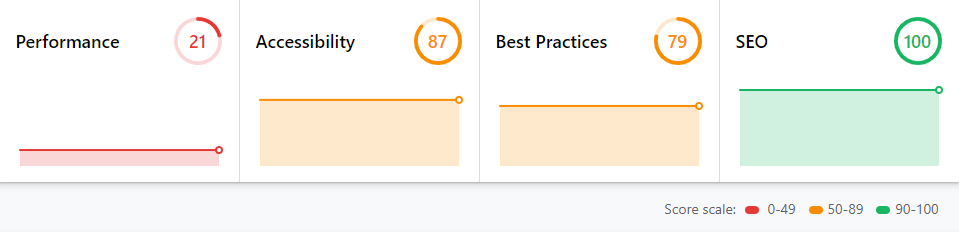

----------

> #### 📈 [Bundlephobia](https://bundlephobia.com/)
> Bundlephobia lets you find out the real cost of adding npm packages to your bundle, by analyzing the bundle size of each package. You can generate a report by dropping your `package.json` file into the tool. This will generate a report for each package used, how much it adds to your load time, and what is the total cost of all packages combined.

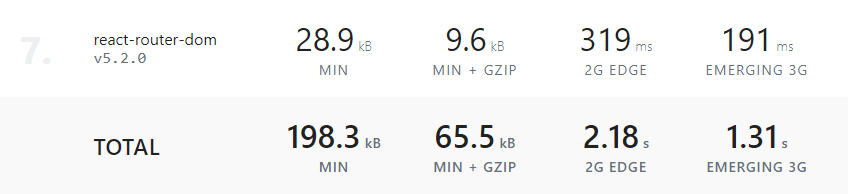

----------

> #### 📈 [GTMetrix](https://webhint.io/)
> GTmetrix helps you discover performance issues and provides you with optimization opportunities. It generates a report for you with the most impactful issues at the top.

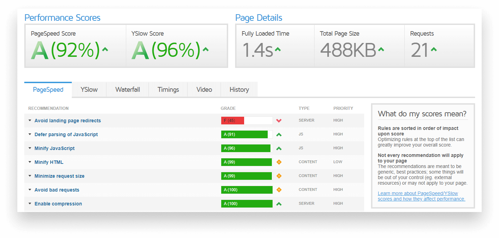

----------

> #### 📈 [WebPageTest](https://www.webpagetest.org/)
> WebPageTest categorizes your site from *A* to *F* in the following metrics:
> - Security score
> - First Byte Time
> - Keep-alive Enabled
> - Compress Transfer
> - Compress Images
> - Cache static content
> - Effective use of CDN
----------

> #### 📈 [Pingdom Website Speed Test](https://tools.pingdom.com/)
> The Pingdom Website Speed Test lets you insert your URL for inspection. It analyzes page load time, gives you hint on how to improve your page's performance, and let's you find bottlenecks by giving you a detailed report.
----------

> #### 📈 [Varvy](https://varvy.com/pagespeed/)
> The Varvy SEO tools are now unavailable due to their legacy nature. We're hoping to get them back sometime in the future.
----------

### Chrome Extensions
ℹ️ *Chrome extensions can help you enhance your workflow by providing some additional debugging tools on top of Chrome DevTools*

> #### 💻 [React Developer Tools](https://chrome.google.com/webstore/detail/react-developer-tools/fmkadmapgofadopljbjfkapdkoienihi)
> This Chrome extension is an essential tool for any React developer. It adds two additional tabs to your Chrome DevTools:
>
> - **⚛️ Components:** Shows you the rendered components tree, with information on each component's props and state.
> - **⚛️ Profiler:** The Profile tab lets you record performance information for React components to easily identify unnecessary renders that may cause slow performance.
----------

> #### 💻 [Web Vitals](https://chrome.google.com/webstore/detail/web-vitals/ahfhijdlegdabablpippeagghigmibma)
> This Chrome extension measures Core Web Vitals, providing instant feedback on loading, interactivity and layout shift metrics. It reports the same metrics you find in Lighthouse, Page Speed Insights, or Search Console.
----------

## 🏗️ HTML Optimization
ℹ️ *Optimizing HTML is often overlooked. However, it is a core part of any web application, therefore you should take good care of it, just as you do for other assets.*

> #### ☑️ Write Valid and Readable DOM
> This include steps that not only helps in terms of performance, but also creates a more dev friendly environment:
> - **Write in all lowercase:** Every tag should be lowercase, so please don't use any uppercase in HTML tags.
> - **Indentation is key to readability:** Use it to avoid a flat, cluttered document. Enhancing readability also means it reduces development time.
> - **Close self-closing tags:** This was once mandatory. With HTML5 it’s optional and purely up to the developer. Either use it on all tags or don’t use it at all. The key here is being consistent.
> - **Avoid overusing comments:** Unless you have a build system in place or you are using a template engine, these can add up and increase the weight of your HTML file.
> - **Organize DOM:** Always consider if you need that extra div or extra element. Try to create only the absolute necessary ones and divide only large parts of your page with not `div`s, but semantic HTML elements.
----------

> #### ☑️ Don't Use Inline Styles and Scripts
> Always use external stylesheets. Also, try to avoid using `import` statements in your CSS files. They produce extra server requests. Also make sure you bundle files together to reduce the number of network requests. If bundle size is a problem for you, you can split them up into 2-4 smaller chunks and take advantage of [domain sharding](https://developer.mozilla.org/en-US/docs/Glossary/Domain_sharding)
>
> 📖 [MDN Web Docs - Domain Sharding](https://developer.mozilla.org/en-US/docs/Glossary/Domain_sharding)
----------

> #### ☑️ Inline Critical CSS
> Critical CSS refers to the minimum set of CSS that is required to render the top of your page, a user sees first when landing on your site.
> Consider inlining critical CSS. By doing so, users will get to see the first portion of your page rendered more quickly.
> *(Critical CSS is also referred to as “above the fold” CSS)*

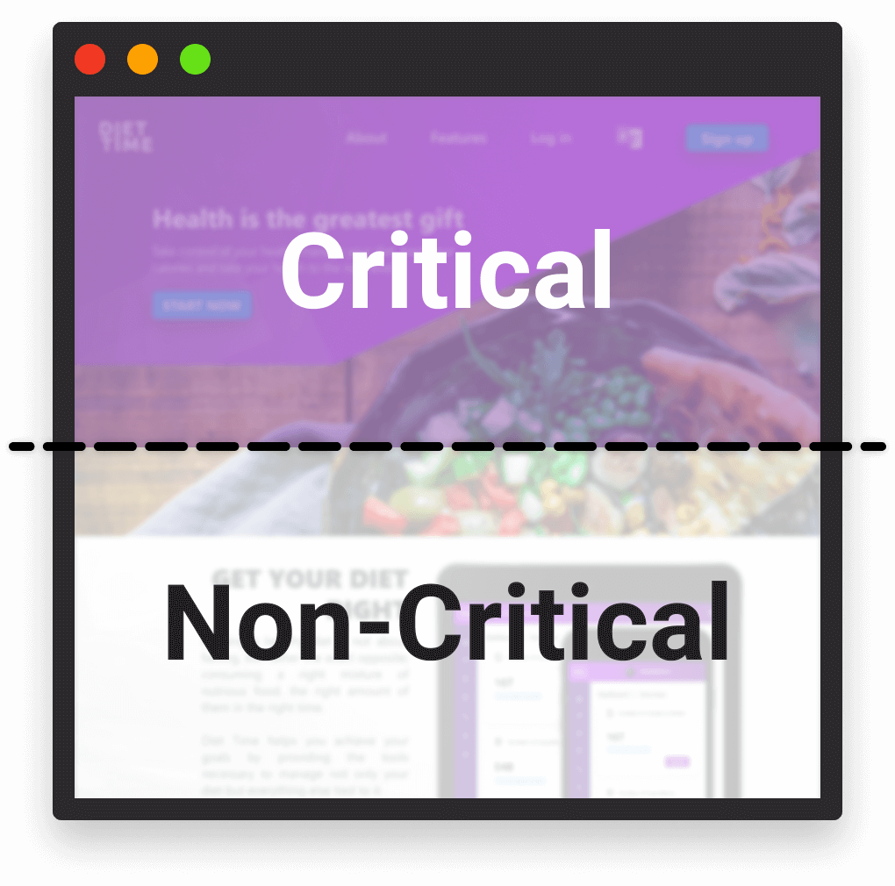

----------

> #### ☑️ Place Script Tags at the Bottom
> This way, all the content of the body will get loaded in, before you load the content of the script tag. In return, you can trick your users into believing that your page is loading faster than it actually is.
>
>You can also add a `defer` tag to your script tags to make sure the HTML gets loaded first. To get a good grasp on what is the difference between a normal, and an `async` vs `defer` script tag, take a look at the following example:

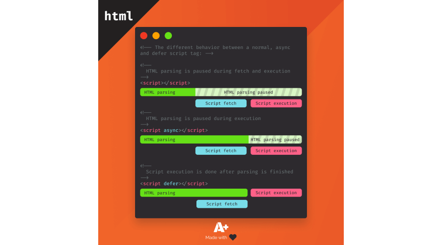

----------

> #### ☑️ Avoid Using Plugins
> Search engines can't index plugin content, and many devices restrict plugins or don't support them. Therefore it's better to leave them out and cut down on some precious bytes.
>
> Elements such as `embed`, `object` or `applet` are checked and if their MIME type matches any of the following:
> - `application/x-java-applet`
> - `application/x-java-bean`
> - `application/x-shockwave-flash`
> - `application/x-silverlight`
> - `application/x-silverlight-2`
> 
> Then it will be flagged as a plugin.
>
> 📖 [Web.dev - Document avoids plugins](https://web.dev/plugins/)
----------

> #### ☑️ Reduce the Number of DOM Elements
> Monitor the number of DOM elements present on your page. Make sure you don't:
>
> - Have more than 1500 DOM nodes
> - Have a depth greater than 32 nodes
> - Have a parent node with more than 60 children
> 
> Having excessive amount of DOM nodes on your page can affect performance in a number of ways:
>
> - Slow down initial page load time
> - Slow down rendering performance
> - Can cause heavy memory usage
>
> 📖 [Web.dev - Avoid an excessive DOM size](https://web.dev/dom-size/)

```javascript
// The fastest way to count the number of DOM nodes on your site
// is using the all (*) query selector
document.querySelectorAll('*').length;
```

----------

> #### ☑️ Compress HTML
> Compress your HTML to further reduce file sizes, after you've [validated them](https://validator.w3.org/). You can use third party libraries, build tools, bundlers or online applications for this.
>
> 🛠️ [W3C - Markup Validation Service](https://validator.w3.org/)  
> 🛠️ [NPMJS - HTMLMinifier](https://www.npmjs.com/package/html-minifier)  
> 🛠️ [Webpack](https://webpack.js.org/)  
> 🛠️ [HTML Minifier](https://www.willpeavy.com/tools/minifier/)
----------

## 🖍️ CSS Optimization
ℹ️ *CSS may seem like an unusual choice for performance optimization, however taking good care of your CSS assets can come a long way, as little repetitions do add up.*

> #### ☑️ Reconsider if you really need a framework
> There are now many lightweight alternatives to robust frameworks. Usually, you won’t be using every selector from a framework, so your bundle will contain dead code. you can identify unused CSS rules using code coverage in DevTools.
>

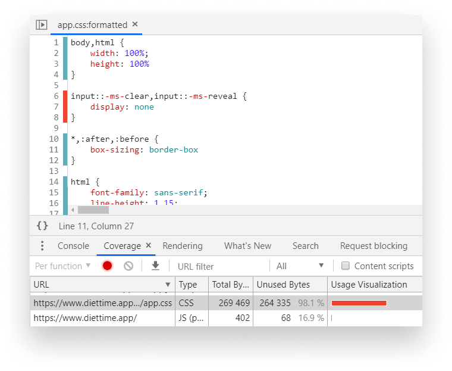

----------

> #### ☑️ Prefer Using a CSS Methodology
> CSS methodologies helps you to create consistency and modularity across your CSS files, which can lead to leaner file sizes. Some popular CSS methodologies are:
>
> 📖 [BEM - *(Block, Element, Modifier)*](http://getbem.com/)  
> 📖 [ITCSS - *(Inverted Triangle CSS)*](https://itcss.io/)  
> 📖 [OOCSS - *(Object-oriented CSS)*](https://github.com/stubbornella/oocss/wiki)
----------

> #### ☑️ Use Markup Instead of CSS
> You can reduce the size of your CSS bundles by simply using correct HTML elements.

```css
/* 🔴 Instead of resetting styles */
span.heading {
    display: block;
    font-size: 1.2em;
    margin-top: 1em;
    margin-bottom: 1em; 
}

/* ✅ Use a heading */
h1 { ... }
```
----------

> #### ☑️ Use Shorthand Properties
> To further reduce the number of rules, always try to go with shorthand properties with `margins`, `paddings`, `borders`, or `backgrounds`.
>
> 📖 [MDN Web Docs - Shorthand properties](https://developer.mozilla.org/en-US/docs/Web/CSS/Shorthand_properties)

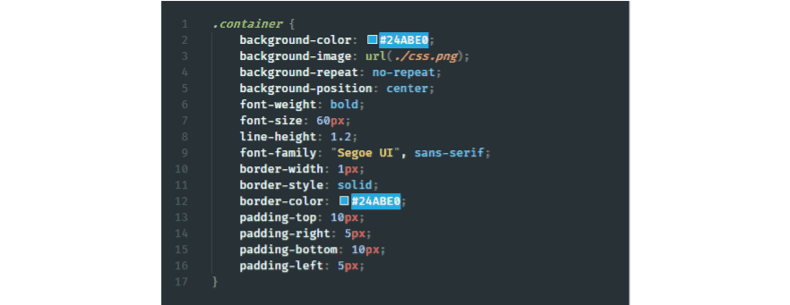

----------

> #### ☑️ Reduce Redundancy
> Sometimes it’s hard to spot redundancy, especially when repeating rules don’t follow the same order in both selectors. If your classes differ in just one or two rules, it’s better to outsource those rules and use them as an extra class.

```html
<!-- 🔴 Instead of -->
<style>
    .warning {
        width: 100%;
        height: 50px;
        background: yellow;
        border-radius: 5px;
    }

    .elevated-warning {
        width: 100%;
        height: 50px;
        font-size: 150%;
        background: yellow;
        box-shadow: 1px 2px 5px #CCC;
        border-radius: 5px;
    }
</style>

<div class="warning">⚠️</div>
<div class="elevated-warning">🚨</div>
```

```html
<!-- ✅ Do -->
<style>
    .warning {
        width: 100%;
        height: 50px;
        background: yellow;
        border-radius: 5px;
    }

    .warning--elevated {
        font-size: 150%;
        box-shadow: 1px 2px 5px #CCC;
    }
</style>

<div class="warning">⚠️</div>
<div class="warning warning--elevated">🚨</div>
```

----------

> #### ☑️ Avoid Complex Selectors
> There are two major problems with using complex selectors. First, your increased specificity will not only make it harder to later rewrite existing rules, but also increase the time it takes for the browser to match selectors.
----------

> #### ☑️ Use Mobile First
> When you are dealing with media queries, always use mobile-first. This will ensure that you mostly add extra rules to cater for large screen devices, rather than rewriting existing CSS rules. This can reduce the number of rules you end up with.
>
> 📖 [MDN Web Docs - Mobile first](https://developer.mozilla.org/en-US/docs/Web/Progressive_web_apps/Responsive/Mobile_first)

```css
/* 🔴 Non mobile-first media query, everything below 600px will get the below styles */
@media (max-width: 600px) {
    /* your CSS rules */
}

/* ✅ Mobile-first media query, everything above 600px will get the below styles */
@media (min-width: 600px) {
    /* your CSS rules */
}
```

----------

> #### ☑️ Compress CSS
> Compress your bundles to reduce their size. Compression removes comments and white spaces, so your bundles require less bandwidth to fetch. Another great way to further reduce the size of your CSS  — and markup— is obfuscating class names. To achieve this, depending on your project setup you can:
>
> - **Webpack**: use the [`css-loader`](https://github.com/webpack-contrib/css-loader) module
> - **Gulp**: use the [`gulp-minify-cssnames`](https://www.npmjs.com/package/gulp-minify-cssnames) plugin
> - **Own implementation:** if you don't have a dedicated package for your project, you can also [use your own implementation](https://www.webtips.dev/how-i-reduced-my-css-bundle-size-by-more-than-20-percent).

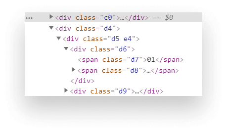

----------

## 👨‍💻 JavaScript Optimization
ℹ️ *Bad JavaScript implementations are usually the main cause of sluggish, slow responding interfaces. When you write your JavaScript files, keep in mind the following points.*

> #### ☑️ Defer JavaScript Files
> As described in the [HTML section](#place-script-tags-at-the-bottom), try to defer your JavaScript assets to avoid render blocking the page. You can achieve this by moving your resources to the bottom of the page and placing them before the closing of your `body` tag. You can also defer non critical resources by using the `async` or `defer` attributes.

```html
<!-- 🔴Instead of -->
    ...
    <script src="app.js"></script>
</head>

<!-- ✅ Do -->
    ...
    <script src="app.js"></script>

    <!-- Also try to make use of `async` /` defer` tags -->
    <script src="app.js" async></script>
    <script src="app.js" defer></script>
</body>
```

----------

> #### ☑️ Update Libraries
> Make sure your dependencies are all updated. This not only helps improve the security on your page by patching common security vulnerabilities for packages, but may also improve the size of your bundles. To know what is the real cost of your `node_modules` for your project setup, you can use Bundlephobia.
>
> 🛠️ [Bundlephobia](https://bundlephobia.com/)
----------

> #### ☑️ Use Web Workers
> Use web workers for complex calculations. JavaScript runs on the main thread in the browser. This means that long-running tasks can freeze up the page and block user interaction. If you have heavy computational work to do, do it inside a web worker. They run on a separate thread and are non-blocking.
>
> *Note: You don’t have access to the DOM inside a web worker.*
----------

> #### ☑️ Eliminate Long-running Tasks
> Long-running JavaScript tasks are usually behind input delays. You can identify them through profiling your page with DevTools' Performance Tab. Anything shown in the stack with a red triangle is a long-running task that could be refactored to take less time to process.
>
> 📖 [MDN Web Docs - Intensive JavaScript](https://developer.mozilla.org/en-US/docs/Tools/Performance/Scenarios/Intensive_JavaScript)

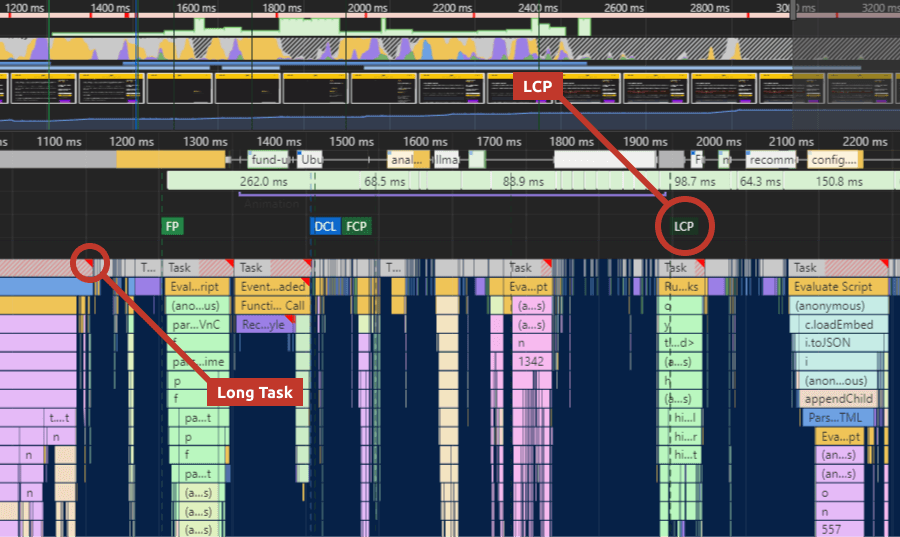

----------

> #### ☑️ Use the Coverage Drawer
> The coverage tab can be a powerful tool to see which code you truly need during page load. Anything that you see in red on the image below, is not executed right away. This means you can potentially defer and request it after loading has finished.

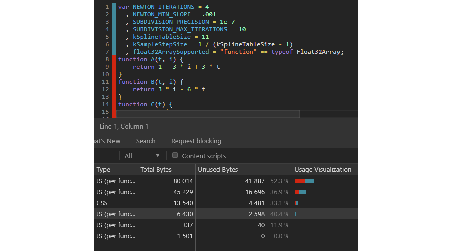

----------

> #### ☑️ Avoid Micro-Optimization
> It may sound tempting to optimize every bit of your code, but you’ll only save a fraction of a millisecond by doing so, and you may end up sacrificing readability and maintainability for performance. Only break this rule if you are making video games or computation-heavy applications, where every bit counts.
----------

> #### ☑️ Compress JavaScript
> Just as for HTML and CSS, make sure you always minify, and also obfuscate your JavaScript code to add a little bit of security to your page. You should do this as part of your build process.
>
> 🛠️ [JavaScript Minifier](https://javascript-minifier.com/)  
> 🛠️ [JSCompress](https://jscompress.com/)  
> 🛠️ [Minify](https://www.minifier.org/)
----------

## 🖼️ Image Optimization
ℹ️ *Most of the time, images account for most transferred bytes, meaning you can gain the most on performance by optimizing them. To start doing so, you need to know where and what types of images you are using.*

> #### ☑️ Replace Images
> Some images can be removed and replaced by utilizing CSS effects. These include things like:
>
> - Drop shadows
> - Triangular shaped objects, arrows
> - Tooltips
> - Speech bubbles
> - Toggles and other more complex UI handlers
>
> If you need to display text on images, use web fonts instead of encoding them into the image itself. This helps reduce resource size.
----------

> #### ☑️ Use Vector Images
> Whenever you’re using a combination of different geometric shapes in your images, prefer using vector instead of raster. Vector images are resolution- and scale-independent making them a good choice in a world with high resolution and different screen size devices. Note the difference between the two:
>
> 📖 [Shutterstock - Raster vs. Vector: What’s the Difference and When to Use Which](https://www.shutterstock.com/blog/raster-vs-vector-file-formats)

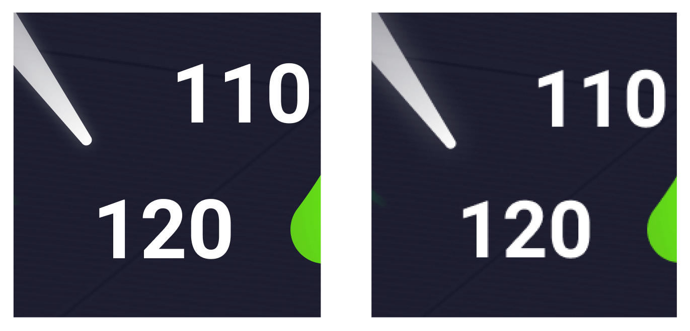

----------

> #### ☑️ Minify SVG Markup
> The XML markup that makes up an SVG often contains unnecessary metadata added by applications that generate them. These can be safely removed to ensure you are only delivering the absolutely necessary pieces and nothing more.
>
> 📖 [CSS Tricks - Tools for Optimizing SVG](https://css-tricks.com/tools-for-optimizing-svg/)
----------

> #### ☑️ Choose the Right Raster Format
> Picking the right raster image format is essential to get precious bytes saved. To choose which format is best for you, go over these questions:
>
> 1. *"Do I need animations?"*  👉 go with **GIF**
> 2. *"Do I need transparency?* 👉 go with **PNG-8/24**
> 3. *"Do I need to preserve fine details?"* 👉 go with **PNG-8/24**, else go with **JPG**
> 4. *"Do I have more than 256 colors in my palette?"* 👉 go with **PNG-24**
> 5. Otherwise, go with **PNG-8**

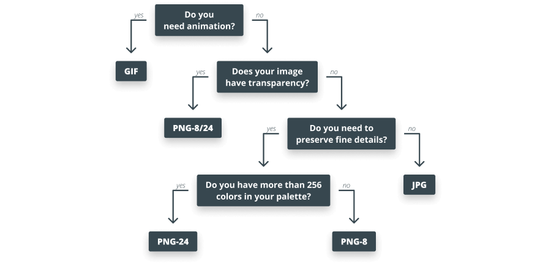

----------

> #### ☑️ Scale Your Images
> Resize your images and ensure that the display size is as close to the natural size of the image as possible. If you are displaying a `300x150px` image on your site, there’s no need for it to be `1500x750`.
>
> You can also use a `srcset` to display responsive images, and ensure that your images are as close to the device's display size as possible.
>
> 📖 [MDN web docs - Responsive images](https://developer.mozilla.org/en-US/docs/Learn/HTML/Multimedia_and_embedding/Responsive_images)

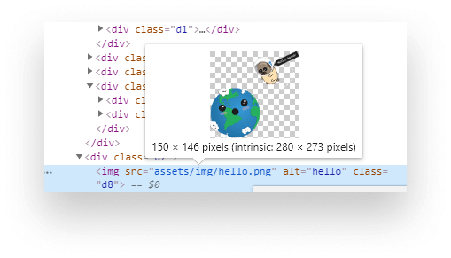

```html
<!-- Use `srcset` with sizes to display different images based on screen size -->


```

----------

> #### ☑️ Lazy Load Images
> Many images are off-screen initially, so there’s no point in downloading every single one of them upfront. By lazy loading them, you can reduce initial page load and enhance performance. Especially on websites that are content-heavy, like image galleries or social networks based around image posts.
>
> You can set the `loading` attribute to `lazy` in HTML to natively lazy load images where the browser supports it. For older browsers, you can provide a fallback solution, such as using the `IntersectionObserver` API.
>
> 📖 [Webtips.dev - How to Lazy Load Images Natively](https://www.webtips.dev/how-to-lazy-load-images-natively)  
> 📖 [Webtips.dev - How to Lazy Load Images With Intersection Observer](https://www.webtips.dev/how-to-lazy-load-images-with-intersection-observer)

```html
<!-- 
    Lazy-loading an image natively.
    Whenever the image comes close to the viewport, a request will be made to fetch the image.
--->

```

```javascript
// Make sure you provide fallback for browsers that do not support the `loading` attribute.
if ('loading' in HTMLImageElement.prototype) { 
    // This means the browser supports lazy-loading natively, you are good to go
} else {
    // This means the browser does not support lazy-loading natively
}
```

----------

> #### ☑️ Compress Images
> Just like SVGs, many raster images contain metadata like camera information or even geolocation. These can be safely removed.
>
> Apart from removing meta information, you can further reduce file size with lossy compression. Due to the way of how our eyes work, you can reduce resolution without noticing a difference.
>
> 🛠️ [TinyPNG](https://tinypng.com/)
----------

## 🗛 Font Optimization
ℹ️ *Just like for images, in order to know where you can make improvements, you need to first monitor your font usage, although the techniques mentioned here apply to all fonts.*

> #### ☑️ Minimize Number of Font Use
> The simplest and easiest to implement is minimizing the number of fonts used on a page and the number of variants used for each font family. This not only helps in terms of performance, but also creates a more consistent design, making way for better user experience.
>
> You can experiment with font load times on [Google Fonts](https://fonts.google.com/).

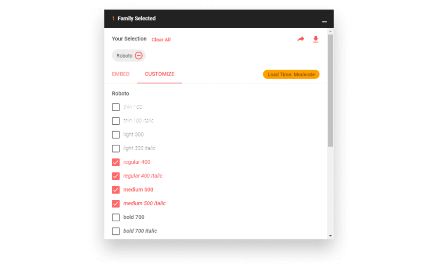

----------

> #### ☑️ Subset Fonts
> Many fonts come with a wide range of glyphs that you will probably never use. If your site is made of only Latin characters, there’s no point in keeping Cyrillic glyphs in your font sets. These fonts can be subset and only include the required Unicode range to further reduce file size.
>
> 🛠️ [NPMJS - Glyphhanger](https://www.npmjs.com/package/glyphhanger)  
> 🛠️ [Transfonter](https://transfonter.org/)  
> 🛠️ [Font Subsetter](https://everythingfonts.com/subsetter)
----------

> #### ☑️ Implement Custom Font-loading Strategies
> By default, font requests are put aside, until the render tree is constructed, meaning we have both DOM and CSSOM ready. This can result in delayed text rendering. By using `rel="preload"`, you can tell the browser to treat the resource with high priority, so fonts can be requested early on.
>
> 📖 [CSS Tricks - A Comprehensive Guide to Font Loading Strategies](https://css-tricks.com/comprehensive-guide-font-loading-strategies/)  
> 📖 [Web.dev - Preload key requests](https://web.dev/uses-rel-preload/)

```html
<!-- Make sure to also specify the type of resource with the `as` attribute -->
<link rel="preload" href="myCustomFont.woff2" as="font" />
```
----------

> #### ☑️ Cache Fonts
> Fonts are static resources. Most of the time, they rarely change, meaning you can provide a long `Cache-Control: max-age` directive to have them cached and avoid unnecessary network requests.
----------

> #### ☑️ Compress Fonts
> Some font formats such as **EOT** or **TTF** are not compressed by default. Make sure to apply some kind of compression to them.
>
> 🛠️ [Font Squirrel - Webfont Generator](https://www.fontsquirrel.com/tools/webfont-generator)
----------

## 🗄️ Server Optimization
ℹ️ *You can make huge improvements, even before your web app receives your assets.*

> #### ☑️ Configure Compression
> If you haven’t already, enable server-side compression. This reduces the size of HTTP responses and has the most impact. To see which type of compression your server supports, go to the "Network" tab in DevTools. Inspect the `Accept-Encoding` header in a request and you’ll see all available options.
>
> According to a benchmark test done by Akamai, brotli outperformed gzip by a median of **21%**.
>
> 📖 [Akamai - Understanding Brotli's Potential](https://blogs.akamai.com/2016/02/understanding-brotlis-potential.html)


----------

> #### ☑️ Minimize the Number of HTTP Requests
> While compression can save significant amounts of data, you can further cut down page load times by minimizing the number of HTTP requests. Some common techniques are:
>
> - Bundling your assets
> - If bundle sizes are too large, you can make use of domain sharding and split them to smaller chunks
> - Use image sprites for CSS
>
> 📖 [MDN Web Docs - Domain Sharding](https://developer.mozilla.org/en-US/docs/Glossary/Domain_sharding)
----------

> #### ☑️ Use a CDN
> Content delivery network can help you reduce response times. A CDN is a collection of servers distributed across the globe. It aims to help deliver content to users faster by choosing the server closest to the user’s location.
>
> 📖 [Akamai - What does CDN stand for? CDN Definition](https://www.akamai.com/us/en/cdn/what-is-a-cdn.jsp)
----------

> #### ☑️ Use a Cache-Control Header
> Cache each resource to avoid unnecessary network trips.
>
> - For static assets that rarely change *(images, fonts)*: use a long expiry date
> - For other resources *(JavaScript, CSS)*: use an appropriate Cache-Control header
>
> 📖 [KeyCDN - How to Propertyl Configure Cache-Control](https://www.keycdn.com/support/cache-control)  
> 📖 [MDN Web Docs - Cache-Control](https://developer.mozilla.org/en-US/docs/Web/HTTP/Headers/Cache-Control)
----------

## 🇼 [Core Web Vitals](https://www.webtips.dev/core-web-vitals)
ℹ️ *Metrics that focus on three aspects of the user experience; loading, interactivity, and visual stability. They aim to quantify user experience, by introducing the below performance metrics*

> #### ☑️ Largest Contentful Paint
> **LCP** for short, measures the time it takes for the browser to fully render the main content of your page. LCP is considered good when it happens [within 2.5 seconds](https://web.dev/lcp/#what-is-a-good-lcp-score).
>
> ❓ **What are the main causes?**
> - Slow server response times
> - Slow resource loading
> - Render blocking elements
>
> ❓ **How can you resolve them?**
> - Optimize your server-side
> - Cut down the number of network requests
> - Lazy load offscreen resources
> - Defer render blocking assets
>
> 📖 [Web.dev - Largest Contentful Paint (LCP)](https://web.dev/lcp/)  
> 📖 [Webtips.dev - Core Web Vitals: Loading](https://www.webtips.dev/core-web-vitals#loading)
----------

> #### ☑️ First Input Delay
> **FID** for short, measures the time it takes for the first user input to be processed. Anything [below 100ms](https://web.dev/fid/#what-is-a-good-fid-score) is considered good.
>
> ❓ **What are the main causes?**
> - Long-running JavaScript tasks
> - Slow resource times
> - Render blocking elements
>
> ❓ **How can you resolve them?**
> - Eliminate long-running JavaScript tasks, that you can identify through DevTools' Performance tab
> - Defer render blocking assets
>
> 📖 [Web.dev - First Input Delay (FID)](https://web.dev/fid/)  
> 📖 [Webtips.dev - Core Web Vitals: Interactivity](https://www.webtips.dev/core-web-vitals#interactivity)
----------

> #### ☑️ Cumulative Layout Shift
> **CLS** for short, measures the amount of layout shifts on your page that causes elements to change position unexpectedly. A good CLS score is [less than 0.1](https://web.dev/cls/#what-is-a-good-cls-score).
>
> ❓ **What are the main causes?**
> - Images with no dimensions
> - Dynamically rendered content
> - Web fonts causing FOIT or FOUT
> - Bad state management *(can be counted as dynamically rendered content)*
>
> ❓ **How can you resolve them?**
> - Define a `width` and `height` property for images
> - Use `srcset` to display different resolution images for different devices
> - Always try to inject dynamic content below already existing content
> - If you use ads, define a fix size for them to reserve space
>
> 📖 [Web.dev - Cumulative Layout Shift (CLS)](https://web.dev/cls/)  
> 📖 [Webtips.dev - Core Web Vitals: Visual Stability](https://www.webtips.dev/core-web-vitals#visual-stability)
----------

> #### ☑️ How to Measure Core Web Vitals?
> If you can't measure it, you don't know where to improve. Some tools that you can use for audits are listed below.
>
> 🛠️ [Lighthouse](https://developers.google.com/web/tools/lighthouse) - *An open-source, automated tool for improving the quality of web pages.*  
> 🛠️ [DevTools Performance Tab](https://developers.google.com/web/tools/chrome-devtools/evaluate-performance) - *Get Started With Analyzing Runtime Performance*  
> 🛠️ [Goolge's PageSpeed Insight Tool](https://developers.google.com/speed/pagespeed/insights/) - *Generate the same Lighthouse report you would get from Chrome's DevTools*  
> 🛠️ [Google's Search Console](https://search.google.com/search-console/about) - *Measures your site's search traffic and performance, and shows which pages needs your attention for optimization*  
> 🛠️ [Web Vitals Chrome Extension](https://chrome.google.com/webstore/detail/web-vitals/ahfhijdlegdabablpippeagghigmibma) - *Chrome extension created for reporting core web vital scores*
----------

## ⚛️ Frameworks
ℹ️ *JavaScript Frameworks deserves a whole section on its own, as each can come with performance best practices on top of vanilla JavaScript.*

### React Optimization Techniques
ℹ️ *A component-based declarative JavaScript Library for building user interfaces both on the web and mobile.*

> #### ☑️ Use Production Build
> By default, React includes many helpful warnings. These warnings are very useful in development. However, they make React larger and slower so you should make sure to use the production version when you deploy the app.
>
> 📖 [React.org - Use the Production Build](https://reactjs.org/docs/optimizing-performance.html#use-the-production-build)
----------

> #### ☑️ Profile Components
> Using either DevTools' built in [Performance Tab](#performance-tab) or the [React Developer Tools](#react-developer-tools) Chrome extension, you can profile and visualize how components are mounted, updated and unmounted. This helps you visualize unnecessary re-renders.
>
> 📖 [React.org - Profiling Components with the Chrome Performance Tab](https://reactjs.org/docs/optimizing-performance.html#profiling-components-with-the-chrome-performance-tab)
----------

> #### ☑️ Virtualize Long Lists
> If you are rendering long lists of data, reduce render time and the number of DOM nodes created by only rendering components that are visible to the user.
>
> 📖 [React.org - Virtualize Long Lists](https://reactjs.org/docs/optimizing-performance.html#virtualize-long-lists)  
> 📺 [YouTube:Addy Osmani - Rendering large lists with react-virtualized or react-window](https://www.youtube.com/watch?v=QhPn6hLGljU)
----------

> #### ☑️ Pre-render routes
> If rendering React on your server is not an option for you, but you still want to improve the first paint of your application, you can try pre-rendering with React snap.
> It uses a headless browser to generate static HTML of every route during build time. These can be shipped along with your bundle to improve page load speed.
>
> 📖 [Web.dev - Pre-render routes with react-snap](https://web.dev/prerender-with-react-snap/)
----------

## 📚 Other Resources
- 🏗️ HTML
    - 📖 [Webtips.dev - 10 Best Practices for HTML](https://www.webtips.dev/10-best-practices-for-html)
    - 📺 [YouTube:Google Chrome Developers - Optimise your code: load code at the right time](https://www.youtube.com/watch?v=eDd6Y6Z50Mg)

- 🖍️ CSS
    - 📖 [Webtips.dev - 10 Best Practices for Quickly Improving Your CSS](https://www.webtips.dev/10-best-practices-for-quickly-improving-your-css)
    - 📖 [Webtips.dev - 7 Tips That Will Help You Get The Best Out of Sass](https://www.webtips.dev/7-tips-that-will-help-you-get-the-best-out-of-sass)
    - 📖 [Webtips.dev - How to Get Better Overview of Your CSS](https://www.webtips.dev/how-to-get-better-overview-of-your-css)

- 👨‍💻 JavaScript
    - 📖 [Webtips.dev - 5 Best Practices for Clean JavaScript](https://www.webtips.dev/5-best-practices-for-clean-javascript)
    - 📖 [Web Fundamentals - Optimize JavaScript Execution](https://developers.google.com/web/fundamentals/performance/rendering/optimize-javascript-execution)
    
- 🗛 Fonts
    - 📖 [Smashing Magazine - Optimizing Google Fonts Performance](https://www.smashingmagazine.com/2019/06/optimizing-google-fonts-performance/)
    - 📺 [YouTube:DevTips - Font Loading Performance 📉 6 Experiments with FOUT & FOIT](https://www.youtube.com/watch?v=vTf9HRTWKtM)

- 🇼 Core Web Vitals
    - 📖 [Webtips.dev - Core Web Vitals: What Are They and Why You Need to Know About Them?](https://www.webtips.dev/core-web-vitals)
    - 📖 [Web.dev - Web Vitals](https://web.dev/vitals/)
    - 📖 [Web.dev - Tools to measure Core Web Vitals](https://web.dev/vitals-tools/)
    - 📺 [YouTube:Google Chrome Developers - Optimize for Core Web Vitals](https://www.youtube.com/watch?v=AQqFZ5t8uNc)

- ⚛️ Frameworks
    - 📖 [ReactJS - Optimizing Performance](https://reactjs.org/docs/optimizing-performance.html)

- 📜 Other
    - 📖 [Webtips.dev - 10 Critical Performance Optimization Steps You Should Take](https://www.webtips.dev/10-critical-performance-optimization-steps-you-should-take)
    - 📖 [Webtips.dev - How to Improve Page Speed by Optimizing Content](https://www.webtips.dev/how-to-improve-page-speed-by-optimizing-content)
    - 📖 [Web.dev - Fast load times](https://web.dev/fast/)
    - 📖 [Web.dev - Measure performance with the RAIL model](https://web.dev/rail/)
    - 📖 [GitHub - Front-End Performance Checklist](https://github.com/thedaviddias/Front-End-Performance-Checklist)
    - 📺 [YouTube:Google Chrome Developers - Improving Load Performance - Chrome DevTools 101](https://www.youtube.com/watch?v=5fLW5Q5ODiE)
